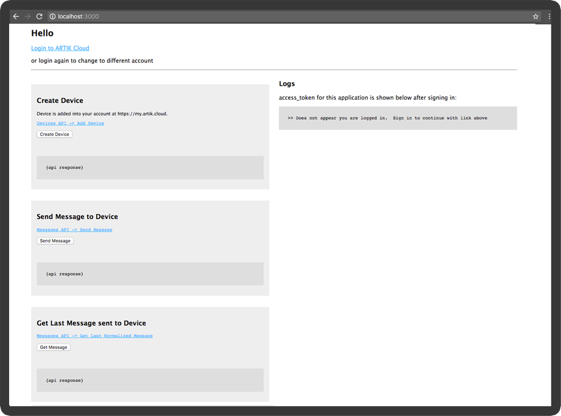

# Sample Web Application using ARTIK Cloud NodeJS SDK 

This is a sample web application demonstrating **ARTIK Cloud NodeJS SDK**.   At time of this reading this uses the [ARTIK Cloud NodeJS SDK (version 2.0.8)](https://github.com/artikcloud/artikcloud-js) to demonstrate creating an ARTIK Cloud application and making SDK API calls.

**After completing this sample, you will learn the following concepts:**

- Setting up <u>ARTIK Cloud Application</u> and adding <u>Application Device Type Permissions</u>
- <u>ARTIK Cloud Login</u> and <u>Granting Permissions</u> for an Application to read / write to device.
- <u>Importing and using the ARTIK Cloud NodeJS SDK</u> 
- Use the SDK to <u>Send Message to Device</u> and <u>Get Message from Device</u> called from your server.

**Note**:  This sample is intended for demonstration purposes as a learning tool and is not recommended for use in a production environment *as-is*.  It is recommended you follow security best practices, security code reviews, and security policies set by your organization.

## Requirements

- [node](https://nodejs.org/en/download/)  (Version >= 6.5.0)
- [npm](https://www.npmjs.com/get-npm) (Version >= 3.10.0)

## Setup

### Setup at ARTIK Cloud

Follow [these instructions](https://developer.artik.cloud/documentation/tools/web-tools.html#creating-an-application) to create an ARTIK Cloud Application.  Here are the settings for this sample: 

-  Under “AUTHORIZATION METHODS” and enable AUTH CODE

- Set “REDIRECT URL” to http://localhost:3000/callback/artikcloud 

- Under “PERMISSIONS”, check “Read” for “Profile”

   Click the “Add Device Type” button. 

   Choose “Example Activity Tracker” as the Device Type

   - Unique Name: cloud.artik.example.activitytracker 
   - Device Type Id:  dt013005c9302a428990073c9d6359b354


-    Device Type Id: dt013005c9302a428990073c9d6359b354

   Enable “Read” and “Write” permissions for this Device Type.

```
After creating the application, note the Client Id and Client Secret, which you will need later for the configuration file.
```

### Setup Project

Before running the sample, fill in the following into your the `config.json` file 

```
parameters:
    "client_id": "your application client id",
    "client_secret": "your application secret",
    "redirect_uri": "http://localhost:3000/callback/artikcloud",
    "device_type_id": "dt013005c9302a428990073c9d6359b354"
```

**Install dependencies** by calling npm install

 ```
$ npm install
 ```

##### Run Project

```
$ npm start
```

Load the web application via your browser:   http://localhost:3000

## Demo:

1. Click on Login to ARTIK Cloud



2. Enter your credentials


3. Accept Application Permissions.  This grants permission to Read and Write to the specified Device Type: Example Activity Tracker (`cloud.artik.example.activitytracker`)


4. Your access token is granted to make additional api calls


5. Create Device will add an Activity Tracker to your account


6. Send Message will send a message to your Device.


7. Get Message will retrieve the last message that was sent to the device.


## More about ARTIK Cloud

If you are not familiar with ARTIK Cloud, we have extensive documentation at [https://developer.artik.cloud/documentation](https://developer.artik.cloud/documentation)

The full ARTIK Cloud API specification can be found at [https://developer.artik.cloud/documentation/api-spec.html](https://developer.artik.cloud/documentation/api-spec.html)

Peek into advanced sample applications at [https://developer.artik.cloud/documentation/samples/](https://developer.artik.cloud/documentation/samples/)

To create and manage your services and devices on ARTIK Cloud, visit the Developer Dashboard at [https://developer.artik.cloud](https://developer.artik.cloud/)

## License and Copyright

Licensed under the Apache License. See [LICENSE](./blob/master/LICENSE).

Copyright (c) 2017 Samsung Electronics Co., Ltd.


This project uses [express](https://expressjs.com/) framework.  Here are the file of interest you should peek into:

```
routes/index.js				// (web routes and sdk usage here)
views/index.pug				// (view)
config.json					// (configuration)
package.json				// (added dependencies including artikcloud-js)
public/javascripts/app.js	 // (javascript)
```


Cleanup Project:

The sample will create a device called Example Activity Tracker <Number> into your account.   It is recommended you clean up your account by going to 'https://my.artik.cloud' and deleting each device you created.

